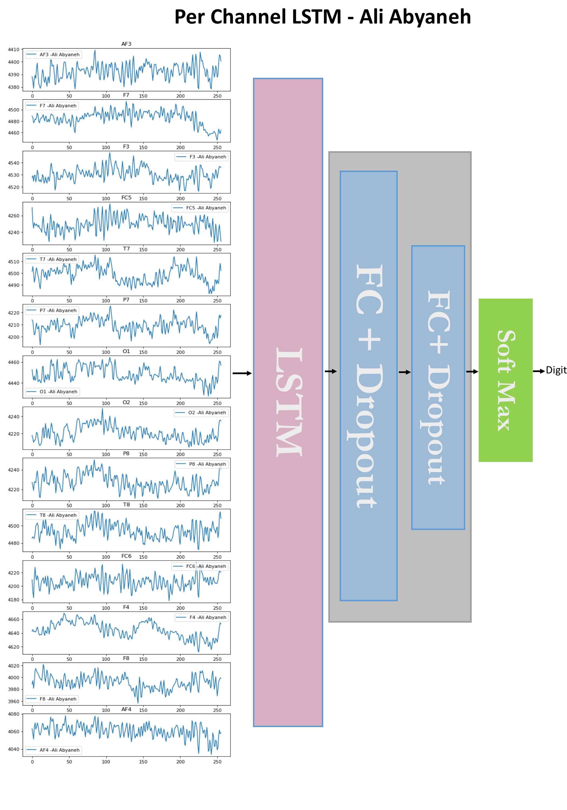

# Extracting-Image-from-EEG-signals
## Abstract
Consider that we were able to read the human mind, vision, and hearing, and transfer them into a machine. Without any shadow of doubt, this tempting idea can pave the way for quite a few advancements in the technology. Take, for instance; we were able to use human sight in a machine. By doing so, we could use human vision potentials in many machine vision applications.  
In general, the goal of this project is reconstructing an digit, seen by a human, from the EEG signals which are captured when the very human was looking at the digit. In particular, I am using MindBigData the "MNIST" of Brain Digits dataset, about which I have explained in the follwoing sections.  
To achieve that aim, I have used several deep learning approaches. In the first place, I tried to use transfer learning. Therefore, I read several papers, and I looked at several projects with a similar objective. In the first place, I balanced the dataset, in that it was heterogeneous. In the second place, I used an auto-encoder network to reduce the dimension of the data( then I decided not to use that in the final model!). So far, I have implemented several deep CNNs and LSTMs with different architectures. Note that all of the models are implemented with Teolnsorflow and Keras. Moreover, I used Talos, which is a hyper-parameter optimization tool, to achieve the best model. 
Currently, I am working on a decision forest which decides between more than 50 sparse CNNs outputs, all of which are trained with the mentioned dataset, and several other features such as signals mean and standarad deviation.

## Mind big data

This dataset, provided by David Vivancos, is composed of records of 2 seconds of EEG signals using several non-medical grade headsets. During the experiment, the subject was presented digits (0 - 9) on a computer, and tried to focus on the digit for about two seconds. The goal is classifying EEG signals into 10 categories, each of which represent a number between 0 and 9 which is obseverd by the subject.  
Data is selected from 14 different location of the brain, the graph of which is shown below.

  
[http://www.mindbigdata.com/]  

## Common LSTM

  

## Stacked LSTM

  

## Per Channel LSTM

  

  

## Note
Feel free to use these codes and documents if it can be helpful for you!
 
Author : Ali Abyaneh
## Refrences
- Deep Learning Human Mind for Automated Visual Classification [https://arxiv.org/pdf/1609.00344.pdf]  
- Personalized Image Classification from EEG Signals Using Deep Learning [https://upcommons.upc.edu/bitstream/handle/2117/109756/Personalized-Image-Classification-of-EEG-Signals-using-Deep-Learning.pdf]
- Brain2Image:Converting Brain Signals into Images,  I.Kavasidis,S.Palazzo,C.Spampinato,D. Giordano 
- [http://www.mindbigdata.com/]  

